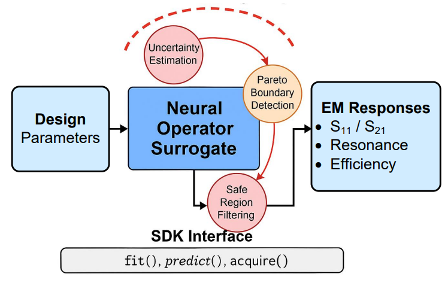

# EM: ActiveEM Artifact Package

An anonymized code package for:

> **Learning Active Surrogate Models for Fast Electromagnetic Simulation via Uncertainty-Aware Acquisition**



This artifact is prepared for rebuttal/revision and contains code templates for:

- reproducible EM benchmark definitions;
- frequency-conditioned FNO surrogate modeling;
- ensemble + MC-dropout uncertainty estimation;
- validation-based uncertainty calibration;
- uncertainty / boundary / Pareto-aware acquisition;
- greedy diversity filtering;
- empirical uncertainty-bounded safe exploration;
- response-domain physics regularization;
- downstream surrogate-guided RF design optimization;
- evaluation, ablation, and plotting utilities.

1. `SyntheticEMSolver` for smoke tests and reviewer inspection;  
2. `ExternalFEMSolver` for connecting an internal full-wave solver.

---

## Repository layout

```text
EM-33ED-artifact/
├── activeem/
│   ├── acquisition.py
│   ├── active_loop.py
│   ├── benchmarks.py
│   ├── data.py
│   ├── encoding.py
│   ├── losses.py
│   ├── metrics.py
│   ├── models.py
│   ├── optimize.py
│   ├── plotting.py
│   ├── solver.py
│   ├── uncertainty.py
│   └── utils.py
├── configs/
│   ├── activeem_default.yaml
│   ├── filter.yaml
│   ├── resonator.yaml
│   └── coupler.yaml
├── scripts/
│   ├── generate_benchmark.py
│   ├── run_active_learning.py
│   ├── run_baselines.py
│   ├── evaluate.py
│   ├── optimize_design.py
│   └── reproduce_tables.py
├── examples/
│   └── quickstart.py
├── tests/
├── docs/
├── requirements.txt
├── environment.yml
├── pyproject.toml
└── Makefile
```

---

## Installation

```bash
python -m venv .venv
source .venv/bin/activate
pip install -U pip
pip install -r requirements.txt
pip install -e .
```

Or with conda:

```bash
conda env create -f environment.yml
conda activate activeem
pip install -e .
```

---

## Quick smoke test

```bash
python examples/quickstart.py
```

Command-line version:

```bash
python scripts/run_active_learning.py \
  --config configs/filter.yaml \
  --rounds 2 \
  --initial 20 \
  --batch 5 \
  --candidate-pool 500 \
  --synthetic \
  --out runs/filter_smoke
```

---

## Rebuttal-style synthetic table generation

```bash
python scripts/reproduce_tables.py \
  --configs configs/filter.yaml configs/resonator.yaml configs/coupler.yaml \
  --synthetic \
  --seeds 0 1 \
  --out runs/rebuttal_tables_synthetic
```

Full rebuttal/revision numbers should be generated with the real full-wave solver by replacing `--synthetic` with an external solver wrapper. See `docs/solver_integration.md`.

---

## Benchmarks

| Task | Physical structure | Main responses |
|---|---|---|
| Filter | Two-pole microstrip bandpass filter with coupled resonators and tapped feed lines | \|S11(f)\|, \|S21(f)\|, f0, bandwidth, insertion loss |
| Resonator | Rectangular substrate-integrated/cavity resonator with slot and feed offset | \|S11(f)\|, f0, Q, min \|S11\| |
| Coupler | Four-port branch-line/directional coupler | \|S11\|, \|S21\|, \|S31\|, \|S41\|, coupling, isolation, insertion loss, phase imbalance |

The YAML files in `configs/` encode the physical parameter ranges, frequency grids, solver outputs, and active-learning schedule.

---

## Method

Active acquisition:

```text
A_t(x) = alpha * U_t(x) + beta * B_t(x) + gamma * P_t(x)
```

where `U_t` is calibrated uncertainty, `B_t` is a response-boundary/local-residual score, and `P_t` is Pareto-front proximity. Unsafe candidates are removed by a calibrated uncertainty threshold, and the final batch is selected with diversity filtering.

Frequency-conditioned FNO input:

```text
z0(j) = P([psi(x), phi(f_j)])
x -> {S11(f), S21(f), ...}_{f in F}
```

The FNO operates over the frequency/response-function axis, conditioned on design parameters.

---

## Scope

- The synthetic solver is for smoke tests only.
- “Safe exploration” means empirical uncertainty-bounded filtering, not a formal safe Bayesian-optimization theorem.
- “Physics regularization” is response-domain regularization over S-parameters and scalar EM metrics unless full-field labels are added.

